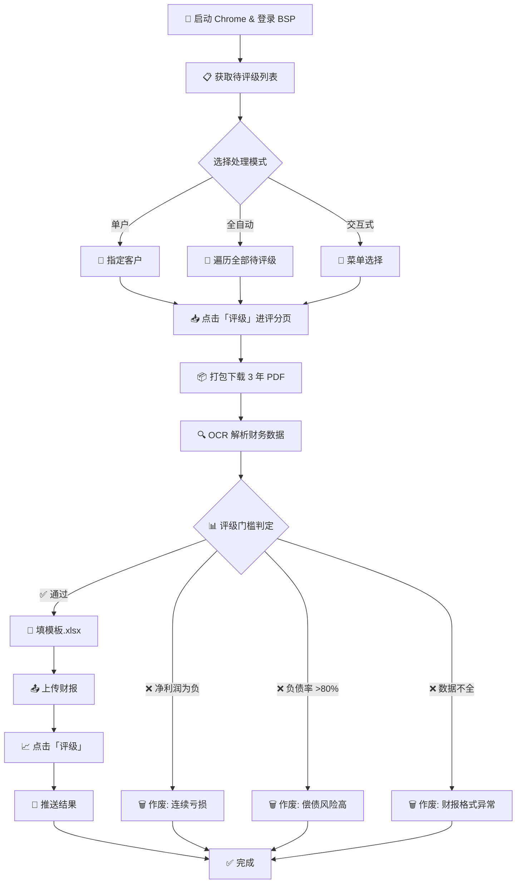

# 🚀 BSP 曼德评级自动化系统

长城供应链金融数据管理平台 — 曼德供应商评级全流程自动化。

> 🔗 GitHub: `github.com/lekelin2046/bsp_automation`
> 📁 路径: `Desktop/AI/bsp_automation/`

---

## 📊 工作流总图



---

## 🧩 单客户处理流程（详细节点）

### Step 1 — 启动
| 节点 | 操作 | 模块 |
|------|------|------|
| ① 启动 Chrome | 自动检测/启动调试 Chrome（CDP 端口 9222） | `browser.py` |
| ② 登录 BSP | 填入账号密码 → 人工输入验证码 | `bsp_client.login()` |

### Step 2 — 进入列表
| 节点 | 操作 | 模块 |
|------|------|------|
| ③ 曼德评级列表 | 导航到 `mdfirm` 页面 | `bsp_client.get_customer_list()` |
| ④ 选择客户 | 待评级 tab 中定位目标企业 | `bsp_client.click_rate()` |

### Step 3 — 下载文件
| 节点 | 操作 | 模块 |
|------|------|------|
| ⑤ 进评分页 | 点击「评级」按钮 | `bsp_client.click_rate()` |
| ⑥ 打包下载 | 点击「打包下载」→ 保存 zip → 解压 | `bsp_client.download_pdfs()` |

### Step 4 — 解析数据
| 节点 | 操作 | 模块 |
|------|------|------|
| ⑦ MinerU 预检 | 免费引擎预览 PDF 格式（可选） | `pdf_parser.mineru_preview()` |
| ⑧ TextIn 解析 | 收费引擎精准提取表格数据 | `pdf_parser.textin_extract()` |
| ⑨ 结构化数据 | 提取 BS 46项 + PL 15项 | `pdf_parser.parse_financial_data()` |

### Step 5 — 决策分支
| 条件 | 结果 | 操作 |
|------|------|------|
| 净利润 ≥ 0, 负债率 ≤ 80% | ✅ 通过 | 进入 Step 6 |
| 净利润 < 0 | ❌ 作废 | `criteria.check_eligibility()` → 作废 |
| 负债率 > 80% | ❌ 作废 | `criteria.check_eligibility()` → 作废 |
| 数据不完整 | ❌ 作废 | `criteria.check_eligibility()` → 作废 |

### Step 6 — 上传评级
| 节点 | 操作 | 模块 |
|------|------|------|
| ⑩ 填模板 | ESG 模板.xlsx → 比对行名 → 填入 3 年数据 | `template_filler.fill_template()` |
| ⑪ 上传财报 | 点击「上传财报」→ 选文件 → 确定 | `bsp_client.upload_financial()` |
| ⑫ 评级 | 点击「评级」按钮 | `bsp_client.click_rate_button()` |

### Step 7 — 推送
| 节点 | 操作 | 模块 |
|------|------|------|
| ⑬ 返回列表 | 点击「返回」 | `bsp_client.click_back()` |
| ⑭ 切到已评级 | 点击「已评级」tab | `bsp_client.click_push()` |
| ⑮ 推送 | 点击「推送」→ 确认 | `bsp_client.click_push()` |

---

## 🖥️ 运行方式

| 命令 | 效果 |
|------|------|
| `python3 main.py` | 交互式菜单，从列表选客户 |
| `python3 main.py --auto` | 全自动遍历全部待评级 |
| `python3 main.py --customer "山东宏远"` | 指定单户 |

---

## 📂 项目文件结构

```
Desktop/AI/bsp_automation/
├── main.py                  # 🎮 入口 - 交互式控制台
├── config.py                # ⚙️ 配置 (URL/账号/Chrome)
├── browser.py               # 🌐 Chrome 调试管理器
├── requirements.txt         # 📦 Python 依赖
│
├── models/                  # 📐 数据模型
│   ├── bs_alias.py          #   资产负债表行名映射
│   └── pl_alias.py          #   利润表行名映射
│
├── skills/                  # 🛠️ 核心能力(可独立复用)
│   ├── pdf_parser.py        #   OCR 双引擎解析 PDF
│   ├── template_filler.py   #   财报模板填写
│   ├── criteria.py          #   评级门槛 & 作废原因
│   └── bsp_client.py        #   BSP 页面操作
│
├── data/
│   └── 模板.xlsx             #   标准财报模板
│
└── records/                 # 📝 操作日志
```

---

## 📥 数据输出路径

```
Desktop/工作/曼德/{客户名}_download/
├── {客户名}_2026-05-27.zip        ← 从 BSP 打包下载
├── extracted/                     ← PDF 解压目录
│   ├── GJ01756-2023.pdf
│   ├── GJ01756-2024.pdf
│   └── GJ01756-2025.pdf
└── {客户名}_报表模板.xlsx          ← 已填好数据的模板
```

---

## ⚙️ Skill 接口说明

每个 Skill 都是独立模块，可单独调用：

```python
# OCR 解析
from skills.pdf_parser import parse_financial_data
(bs_data, pl_data), error = parse_financial_data(pdf_files)

# 门槛判定
from skills.criteria import check_eligibility
ok, reason = check_eligibility(bs_data, pl_data)

# 填模板
from skills.template_filler import fill_template
path = fill_template(name, bs_data, pl_data, template_path, output_path)
```

---

> 📅 首次验证: 2026-05-27 河北崇奥 ✅
> 📝 作废原因模板: 4 种（净利润为负/负债率>80%/数据不全/格式异常）
